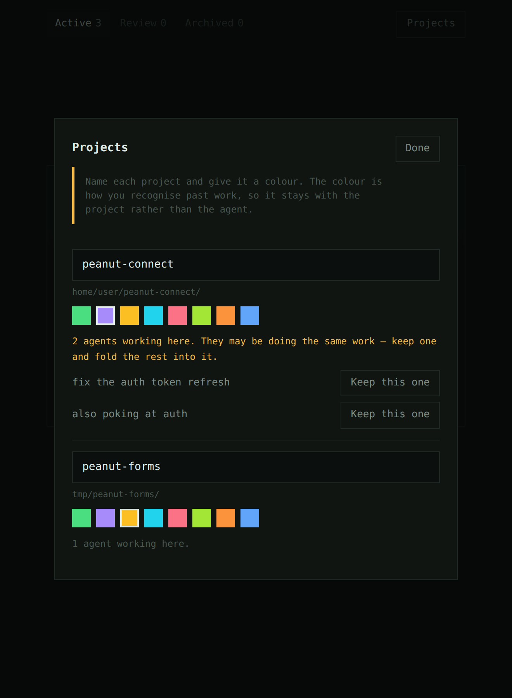

# dino

A skin for the terminal. Something to look at while the work happens.

The terminal is accurate and exhausting, and you spend all day in it anyway.
This is the other half of the desk: a green box that gets on with things, a
caption in English, and a **Keep going** button so answering costs a click
instead of a typed sentence.

It is meant to be left open in the corner of a screen. Most of the time it is
doing nothing much, which is the point — you should be able to tell how things
are going from the corner of your eye, without reading.

| work stacking up | one of them wants you |
| --- | --- |
|  |  |

The dino is the one fixed thing on screen — it never changes colour. Work drops
in from the top as coloured blocks and stacks up beside it, and the dino
reacts: it watches the pile while things are running, looks at you when
something is asking, gets bored when nothing is happening, and does a pleased
little hop when you decide something.

**Colour means project, not agent.** That is the whole point of it: green means
the same repo today as it did last week, so you can recognise past work at a
glance. You set the colour and the name in the Projects panel, and every piece
of work reads as `{project}: {title}`.

## What counts as a project

A project is a **repository**, not a working directory. An agent started in
`peanut-connect/includes` and one started in `peanut-connect` are the same
project — dino walks up from the agent's directory to the nearest `.git` and
uses that. Without it the same repo would get two names, two colours and two
rows, which would make the colour mean nothing.

A directory with no repo above it is simply its own project, which is right for
a notes folder or a scratch directory. Work that reports no directory at all
lands in **Unassigned**, where you can still name and colour it; if it was a
stray it ages out of the list on its own after six hours.



## Two agents on the same repo

The panel counts the agents live in each project, because two agents in one
repo is how the same work quietly gets done twice. When there is more than one,
it says so and offers to fold them together: pick the one to keep, and

- every other agent is **dismissed** — its next parked turn ends instead of
  asking you whether to continue
- the one you keep gets a **note**, delivered the next time it parks, naming
  what it has taken over and telling it to check for overlap before continuing

Worth being precise about the limit: dino only ever speaks to an agent when its
turn is parked at the `Stop` gate, so there is no way to interrupt one
mid-turn. A dismissed agent finishes whatever it is doing right now. It just
does not get invited to start anything else.

### Three tabs

| tab | what's in it |
| --- | --- |
| **Active** | work still in flight |
| **Review** | finished or asking — the queue that wants you |
| **Archived** | what you've fed to the dino |

When a piece of work is done, **Feed it to the dino**: the block slides across
the floor, the dino eats it, and it lands in Archived. That is the whole
ceremony, and it is the only way things leave Review.

Nothing flashes and nothing jumps position, and every animation is stepped
rather than eased — 8-bit things move in whole frames. The words under the
scene are a caption, not a readout: if you have to read them to know how it is
going, the picture above them has failed.

## Try it without wiring anything up

```bash
node tools/dino/bin/dino.mjs demo
```

That starts the window, opens a browser, and drives it with a scripted session
so you can see every state. Click **Keep going** at the end — the terminal
prints what a real agent would have been told.

## Use it for real

```bash
node tools/dino/bin/dino.mjs install   # add the hooks to ~/.claude/settings.json
node tools/dino/bin/dino.mjs           # start the window, leave it open
```

Start a **new** agent session (hooks load at session start) and it appears in
the window. `install --project` writes to `.claude/settings.json` in the current
repo instead of your home directory; `uninstall` takes the hooks back out and
leaves the rest of the file alone.

Worth an alias:

```bash
alias dino="node $PWD/tools/dino/bin/dino.mjs"
```

## How the button actually reaches the terminal

This is the only clever part, and it's worth understanding before trusting it.

Claude Code fires a `Stop` hook when an agent finishes a turn. A `Stop` hook can
answer with `{"decision": "block", "reason": "..."}`, and the agent treats that
reason as its next instruction and carries on. So:

```
agent finishes a turn
  └─ Stop hook fires, posts to the daemon, and waits
       └─ window lights up green, shows what happened
            └─ you click "Keep going"
                 └─ daemon answers the hook
                      └─ hook prints {"decision":"block","reason":"Keep going."}
                           └─ agent continues
```

"All good, stop" and a click that never comes both let the turn end normally.

**It fails open, deliberately.** If the daemon isn't running, is slow, or throws,
the hook exits silently and the agent behaves exactly as if this tool didn't
exist. Nothing here can wedge a session — that property is what makes it safe to
leave installed, and `test/loop.test.mjs` covers it.

## What's here

| file | what it does |
| --- | --- |
| `bin/dino.mjs` | the CLI — `start`, `demo`, `install`, `uninstall`, `hook` |
| `src/server.mjs` | loopback daemon: takes hook events, serves the UI, holds turns open |
| `src/state.mjs` | what each session is doing, and the gate a parked turn waits on |
| `src/narrate.mjs` | tool calls → English. `Bash: composer run test` → "Running the tests" |
| `src/projects.mjs` | the colour and name you gave each project |
| `src/store.mjs` | the small amount of disk this touches: projects and the archive |
| `src/transcript.mjs` | reads the tail of a session transcript for its closing words |
| `src/hook.mjs` | the shim the hooks run. Fails open, always |
| `src/install.mjs` | idempotent hook wiring, with a backup of your settings |
| `ui/index.html` | the window. One file, no build step, no dependencies |

Zero dependencies, Node stdlib only.

Live sessions stay in memory: the daemon is a companion window, not a record of
anything, and the next hook event repopulates it after a restart. Two things do
persist, under `~/.dino/` (override with `DINO_HOME`): the colours and names you
gave your projects, and the archive. A colour that reset on restart would be
useless for recognising past work, and an archive that emptied would not be an
archive.

## The dinosaur

A rounded green square with eyes. It's the placeholder, and a deliberately
plain one — it is easier to grow a character out of something simple than to
un-commit from something detailed.

The swap point is marked `SWAP POINT` in `ui/index.html`. Two attributes drive
the whole performance:

| attribute | values |
| --- | --- |
| `data-mood` | `bored` · `watching` · `alert` · `pleased` |
| `data-look` | `stack` · `you` · `away` |

Anything honouring those six moods and three directions inherits the lot: the
doze, the breath, the glow in whatever colour is asking, the pleased hop, and
the wandering gaze. Looking is a few pixels of eye movement, which turns out to
be enough.

The rest of the window keeps a retro treatment around it — monospace type,
square corners, hard offset shadows, scanlines, and stepped rather than eased
animation on the blocks. The creature is the one soft thing on screen, which is
the point of it.

## Tests

```bash
node --test 'tools/dino/test/*.test.mjs'
```

`narrate.test.mjs` covers the English. `loop.test.mjs` is the one that matters:
it runs the real hook shim as a subprocess against a real daemon and asserts
that a click comes back out as an instruction the agent will act on.

## Scope

Loopback only, and it should stay that way — it handles transcript paths and
file names, and it has no authentication because it doesn't need any while it's
bound to `127.0.0.1`.

This lives in `tools/` and is not part of the Peanut Connect plugin. It is not
copied by `scripts/package.sh`, which uses an explicit allowlist, so it can
never end up in a plugin zip.
