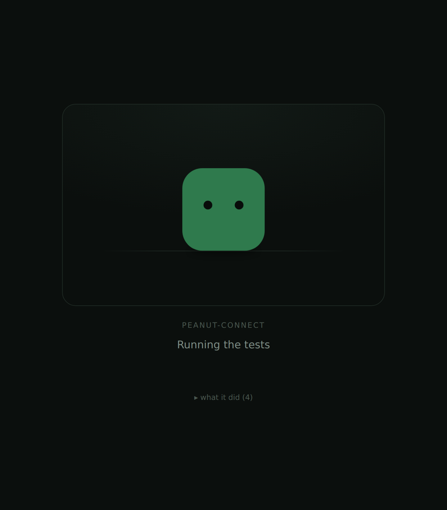
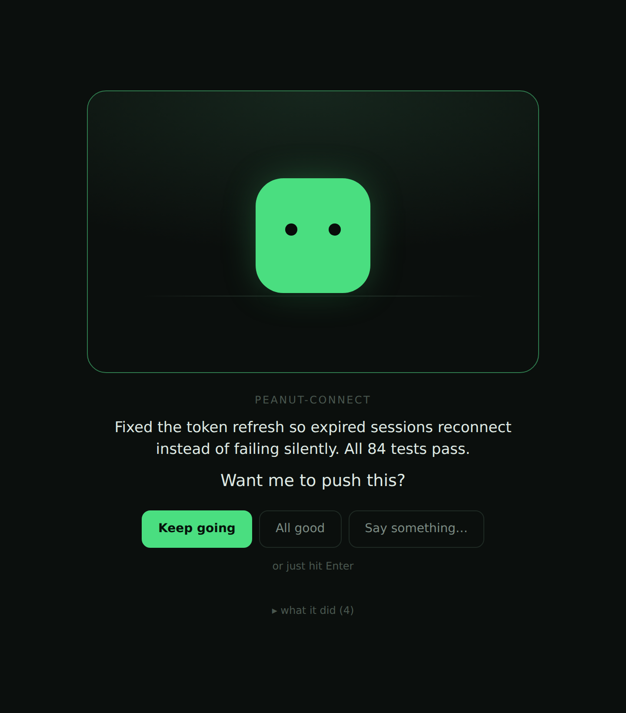

# dino

A skin for the terminal. Something to look at while the work happens.

The terminal is accurate and exhausting, and you spend all day in it anyway.
This is the other half of the desk: a green box that gets on with things, a
caption in English, and a **Keep going** button so answering costs a click
instead of a typed sentence.

It is meant to be left open in the corner of a screen. Most of the time it is
doing nothing much, which is the point — you should be able to tell how things
are going from the corner of your eye, without reading.

| working | wants you |
| --- | --- |
|  |  |

Nothing flashes and nothing jumps position. What changes is colour and posture:
dozing when nothing runs, a slow breath while it works, upright and lit when it
needs you. The words underneath are a caption, not a readout — if you have to
read them to know how it is going, the box above them has failed.

## Try it without wiring anything up

```bash
node tools/dino/bin/dino.mjs demo
```

That starts the window, opens a browser, and drives it with a scripted session
so you can see every state. Click **Keep going** at the end — the terminal
prints what a real agent would have been told.

## Use it for real

```bash
node tools/dino/bin/dino.mjs install   # add the hooks to ~/.claude/settings.json
node tools/dino/bin/dino.mjs           # start the window, leave it open
```

Start a **new** agent session (hooks load at session start) and it appears in
the window. `install --project` writes to `.claude/settings.json` in the current
repo instead of your home directory; `uninstall` takes the hooks back out and
leaves the rest of the file alone.

Worth an alias:

```bash
alias dino="node $PWD/tools/dino/bin/dino.mjs"
```

## How the button actually reaches the terminal

This is the only clever part, and it's worth understanding before trusting it.

Claude Code fires a `Stop` hook when an agent finishes a turn. A `Stop` hook can
answer with `{"decision": "block", "reason": "..."}`, and the agent treats that
reason as its next instruction and carries on. So:

```
agent finishes a turn
  └─ Stop hook fires, posts to the daemon, and waits
       └─ window lights up green, shows what happened
            └─ you click "Keep going"
                 └─ daemon answers the hook
                      └─ hook prints {"decision":"block","reason":"Keep going."}
                           └─ agent continues
```

"All good, stop" and a click that never comes both let the turn end normally.

**It fails open, deliberately.** If the daemon isn't running, is slow, or throws,
the hook exits silently and the agent behaves exactly as if this tool didn't
exist. Nothing here can wedge a session — that property is what makes it safe to
leave installed, and `test/loop.test.mjs` covers it.

## What's here

| file | what it does |
| --- | --- |
| `bin/dino.mjs` | the CLI — `start`, `demo`, `install`, `uninstall`, `hook` |
| `src/server.mjs` | loopback daemon: takes hook events, serves the UI, holds turns open |
| `src/state.mjs` | what each session is doing, and the gate a parked turn waits on |
| `src/narrate.mjs` | tool calls → English. `Bash: composer run test` → "Running the tests" |
| `src/transcript.mjs` | reads the tail of a session transcript for its closing words |
| `src/hook.mjs` | the shim the hooks run. Fails open, always |
| `src/install.mjs` | idempotent hook wiring, with a backup of your settings |
| `ui/index.html` | the window. One file, no build step, no dependencies |

Zero dependencies, Node stdlib only. Nothing is written to disk except the hook
entries in your settings file — if the daemon restarts, the next event
repopulates it.

## The dinosaur

It's a green box. That's on purpose — it's the placeholder.

The swap point is marked `SWAP POINT` in `ui/index.html`. Everything that gives
it life hangs off one attribute, `data-state`, which is one of `idle`,
`working`, `waiting`, `asking`, `blocked`, `done`. Drop in a sprite that honours
those six values and the postures, the glow, the floor shadow and the warming
room all come along for free.

Worth keeping if you do swap it: the floor line and the shadow. Without them the
creature floats in a void and reads as a logo rather than something alive.

## Tests

```bash
node --test 'tools/dino/test/*.test.mjs'
```

`narrate.test.mjs` covers the English. `loop.test.mjs` is the one that matters:
it runs the real hook shim as a subprocess against a real daemon and asserts
that a click comes back out as an instruction the agent will act on.

## Scope

Loopback only, and it should stay that way — it handles transcript paths and
file names, and it has no authentication because it doesn't need any while it's
bound to `127.0.0.1`.

This lives in `tools/` and is not part of the Peanut Connect plugin. It is not
copied by `scripts/package.sh`, which uses an explicit allowlist, so it can
never end up in a plugin zip.
